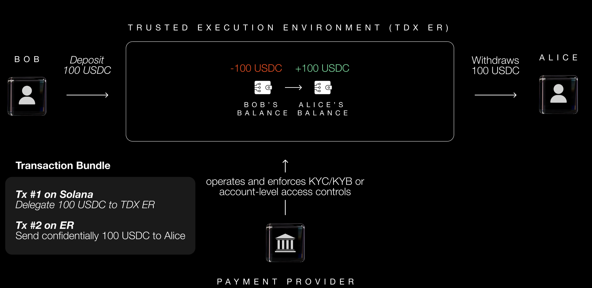
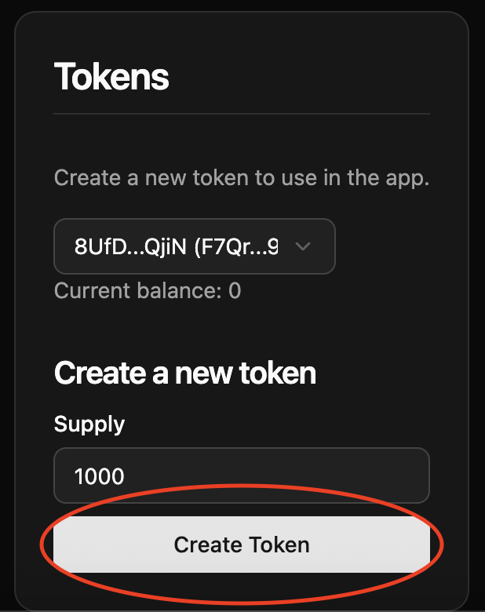
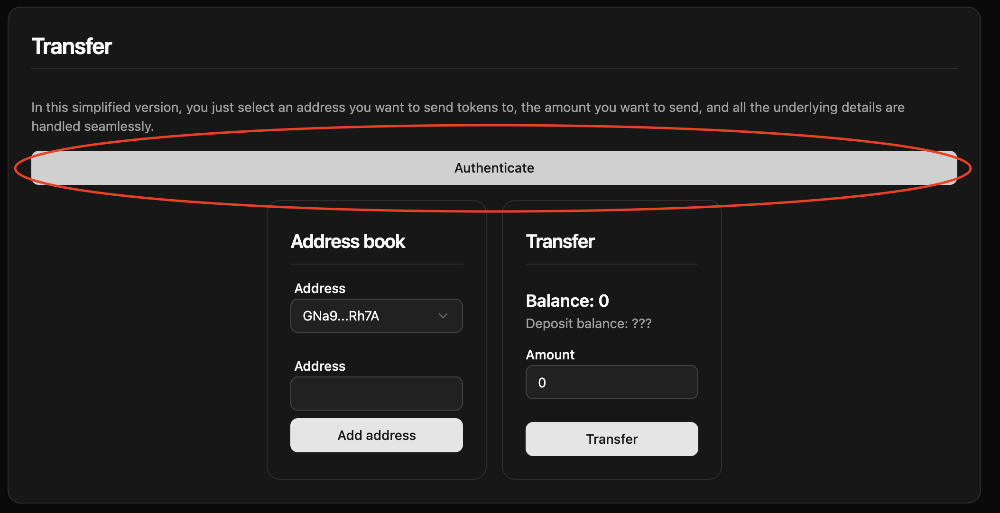
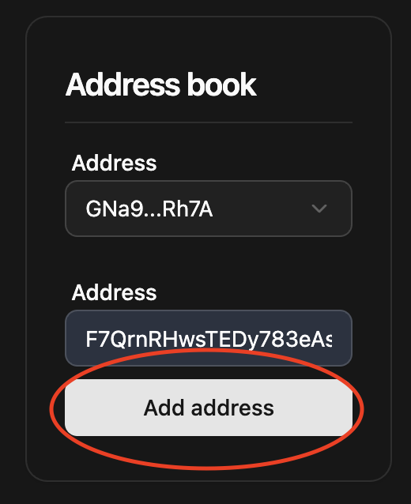
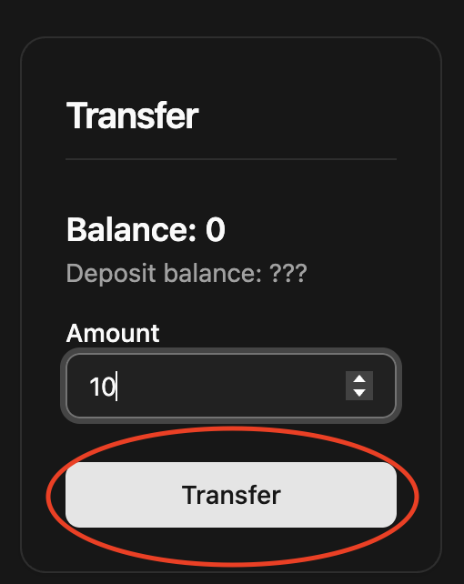

# Private Payments

A simple payment app that works in a Private Ephemeral Rollup.

## Summary

- [Private Payments](#private-payments)
  - [Summary](#summary)
  - [How it works](#how-it-works)
    - [Private Ephemeral Rollup](#private-ephemeral-rollup)
    - [Onchain Demonstration Program](#onchain-demonstration-program)
  - [Payments provider use-case](#payments-provider-use-case)
  - [Running the demo](#running-the-demo)
    - [Installation](#installation)
    - [Run the app](#run-the-app)
    - [Usage guide](#usage-guide)
    - [Test the program](#test-the-program)

## How it works

### Private Ephemeral Rollup

A Private Ephemeral Rollup is a variant of MagicBlock [Ephemeral Rollup](https://docs.magicblock.gg/pages/get-started/introduction/why-magicblock) (ER), that runs the validator inside a Trusted Execution Environment (TEE), specifically Intel Trust Domain Extension (TDX), to provide privacy and auditability.

It introduces a middleware that handles:
- **User identification** by making the user sign a challenge before interacting with the PER.
- **Query filtering** based on the identification and onchain permission metadata defined by the program.

The API of the PER is made to be as transparent as possible for developers: after identifying the user, the middleware returns a token to use in the URL and then simply interact with the PER as if it were a normal RPC (except unauthorized requests will fail).

### Onchain Demonstration Program

This simple onchain program lets users:
1. **Create deposit** accounts for anyone
2. **Deposit and withdraw** from their own deposit account
3. **Delegate and undelegate** to a private ephemeral rollup
4. **Make a transfer** between the user's deposit and any other deposit
5. **Create the permission** account to prevent other users from accessing the delegated deposit account

Using a **Private Ephemeral Rollup** ensures that only permissioned users can view the balance of an account, but still enables anybody to transfer to any other existing deposit.

A typical interaction will go as follows (illustrated below):
1. Bob creates his and Alice's deposit accounts
2. Bob deposits 100 USDC into his deposit account
3. Bob delegates both his and Alice's deposits
4. Bob makes the transfer from his deposit to Alice's
5. Whenever she wants, Alice can undelegate and withdraw the funds to mainnet. Alice can also choose to stay in the Private Ephemeral Rollup and make more transfers.



*NOTE: this program is for demonstration purposes and can be further tailored to the developer's needs.*

## Payments provider use-case

A crypto payments provider can have clients (e.g. merchants) be paid in the PER: users send the payments from mainnet to the provider in the PER, who can then settle payments to the merchant privately. Any subsequent payment can happen directly on the PER.

Benefits:
- No information is leaked regarding which merchant the user is buying from
- Reduced fees for merchants as the transfers are all done using an Ephemeral Rollup
- Using on-ramps and abstracted wallets can make the transactions even more seamless and cheap for the user

## Running the demo

### Installation

```bash
yarn install
cd frontend
yarn install
```

### Run the app

```bash
cd frontend
yarn dev
```

### Usage guide

The program is already deployed on devnet.

1. Create a test



2. Identify as a user



3. Add the address of the recipient



4. Transfer an amount of token




Clicking the transfer button automatically handles creating deposits, depositing the amount, delegating and making the private transfer.

### Test the program

You must have a MagicBlock validator and a test validator running locally: 
1. In MagicBlock validator's repo: `cargo run -- --remote-url http://localhost:8899 --remote-ws-url ws://localhost:8900 --rpc-addr 0.0.0.0 --rpc-port 7799`
2. `solana-test-validator`

```bash
anchor test --skip-local-validator
```
